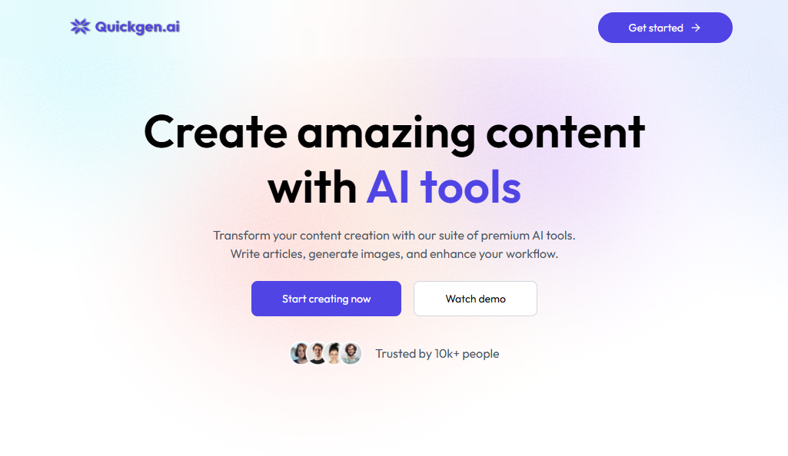
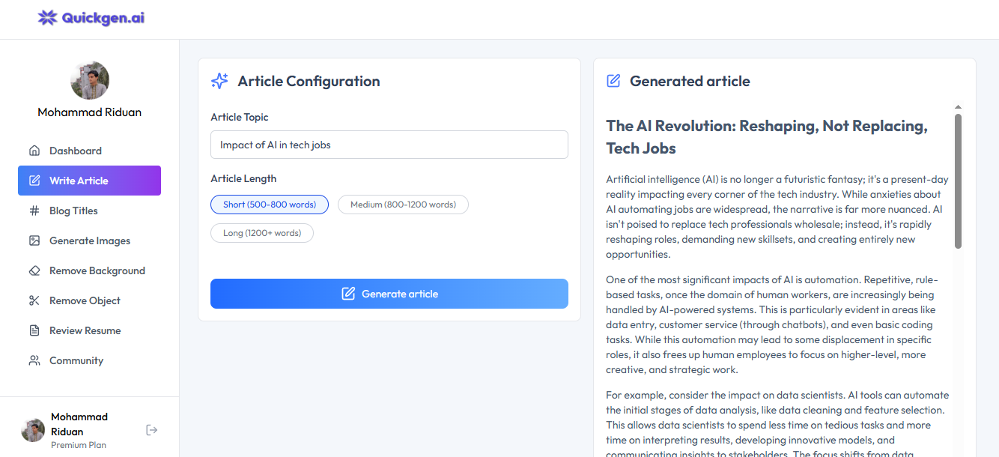
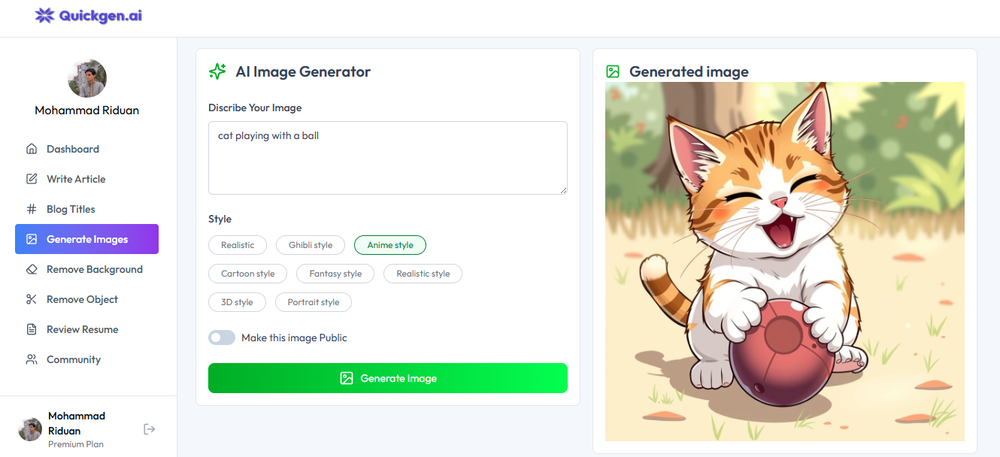
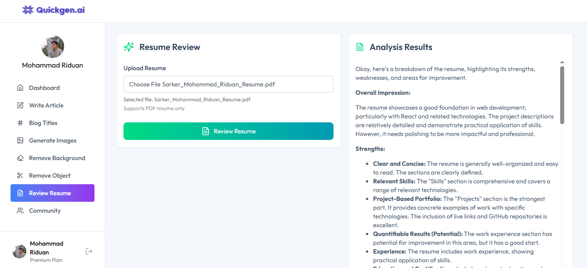

# 🚀 Quickgen.ai – AI-Powered SAAS App

Quickgen.ai is a modern AI SaaS application built on the **PERN stack** (PostgreSQL, Express.js, React.js, Node.js), offering a suite of smart tools for content generation, image manipulation, and resume reviews - all within a beautiful, responsive dashboard.

---

## 🖼️ Preview

<p align="center">
  
  
  
  
</p>

---

## 🔗 Live Demo : [View Live Demo](https://quickgenai-smr.vercel.app/)

---

## 🌟 Features

- ✍️ **Generate Article** – AI-powered article writing based on custom prompts.
- 📰 **Generate Blog Title** – Smart blog title generation to match your content.
- 🖼️ **Generate Image** – Create AI-generated images with prompts.
- 🧽 **Remove Background** – Clean background removal with PNG output.
- 🎯 **Remove Object** – Seamlessly erase unwanted elements from images.
- 🧾 **Review Resume** – Intelligent resume analysis and feedback system.
- 📜 **Dashboard** – View and manage your content generation history.
- 🌐 **Community Feed** – Share your generated images with others and toggle likes.

---

## 🛠️ Tech Stack


### 🧑‍💻 Client

- [React 19](https://react.dev/) – Component-based UI library  
- [Tailwind CSS 4](https://tailwindcss.com/) – Utility-first CSS framework  
- [Clerk](https://clerk.dev/) – Authentication and user management  
- [Axios](https://axios-http.com/) – Promise-based HTTP client  
- [React Hot Toast](https://react-hot-toast.com/) – Toast notification library  
- [Lucide React](https://lucide.dev/) – Beautiful & consistent icon toolkit  
---

### ⚙️ Server

- [Express.js](https://expressjs.com/) – Node.js web application framework  
- [PostgreSQL (Neon)](https://neon.tech/) – Serverless relational database  
- [Clerk Express](https://clerk.dev/docs/backend/express) – Clerk middleware for Express  
- [Multer](https://github.com/expressjs/multer) – Middleware for handling file uploads  
- [Cloudinary](https://cloudinary.com/) – Media storage and optimization  
- [PDF-Parse](https://github.com/modesty/pdf-parse) – Extract text content from PDF files  
- [OpenAI](https://openai.com/) – AI/LLM integration  
- [Dotenv](https://www.npmjs.com/package/dotenv) – Environment variable management  
- [CORS](https://expressjs.com/en/resources/middleware/cors.html) – Cross-origin resource sharing middleware  
- [Axios](https://axios-http.com/) – Also used on server for external API calls  

---

## 📁 Project Structure

```bash
quickgen-ai/
│
├── client/                 # Frontend (React + Vite)
│   ├── components/         # Reusable UI components
│   └── pages/              # Main application pages
│
├── server/                 # Backend (Node + Express)
│   ├── routes/             # All API routes
│   ├── controllers/        # Users, AI features
│   └── config/             # Cloudinary, PDF, Multer
│
├── .env                    # Environment variables
|__ README.md               # Project documentation

```
---

## 📄 License

This project is licensed under the [MIT License](LICENSE).